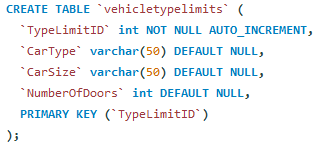

## Overview

### Mobile Car Wash and Detailing Web Application

I developed a comprehensive web application that showcases a fully functional MySQL database, designed specifically for a Mobile Car Wash and Detailing business. The project incorporates ten complex tables that are meticulously structured to ensure data integrity and efficiency. Key features of the database include:

- **Primary and Foreign Keys**: Each table utilizes primary keys to uniquely identify records and foreign keys to establish relationships between tables, ensuring referential integrity.

- **Data References and Constraints**: Implemented constraints to enforce data validation rules, maintaining high data quality throughout the application.

- **Normalization**: The database is normalized to eliminate redundancy and improve data organization, facilitating easier access and manipulation of information.

#### Application Features:
- **Customer Service Request Form**: Users can fill out a detailed form to request services at their preferred location, streamlining the booking process.

- **Dynamic Pricing Model**: Pricing is calculated based on vehicle type and size, allowing customers to choose from various packages and services tailored to their needs.

- **Customer Reviews**: The application includes a section for customer reviews, providing valuable feedback and enhancing user engagement.

- **Employee Wage Adjustment**: A mechanism is in place to adjust employee wages based on customer ratings, promoting high-quality service and incentivizing performance.

This project not only highlights my skills in database design and web development but also demonstrates my ability to create functional applications that meet real-world business needs. 

## Website Structure

### 1. Main Webpage
The landing page features an overview of the car wash services offered, customer testimonials, and links to various sections of the website.

### 2. Book Appointment Page
Customers can select their preferred services, fill out their details, and schedule an appointment through this form.

### 3. Package Price Page
This page lists all available car wash packages, detailed descriptions, and their respective prices.

### 4. Check Appointment Page
Users can check their appointment status and details here.

### 5. Customer Service Page
A dedicated page for customers to reach out for support and queries regarding the services offered.

## SQL Database Components

### ER Diagram

- **Overview:**
  - Illustrates relationships between entities in the database.
  - Highlights one-to-many and one-and-only relationships.

- **One-to-Many Relationships:**
  - Example: Customer to Appointments, Vehicle to Appointments.

- **One-and-Only Relationships:**
  - Emphasizes unique associations, crucial for maintaining data integrity.

- **Optional Relationships:**
  - Examples: Customer Review, Appointment Check.

- **Mandatory Relationships:**
  - Examples: Vehicle Description for Appointment, Car Wash/Detail Package for Appointment.

### Tables Overview

#### Vehicle Table

- **Purpose:** Stores information about vehicles registered by customers.
- **Attributes:** VehicleID, CustomerID (FK), Year, Make, Model, VehicleType, VehicleSize, NumberOfDoors, ExteriorColor, InteriorColor, InteriorMaterial, FloorMatType.
- **Primary Key:** VehicleID.
- **Integrity Enforcement:** FK constraint on CustomerID for referential integrity.

#### vehicletypelimits Table

- **Purpose:** Stores limits and specifications for different vehicle types.
- **Attributes:** TypeLimitID, CarType, CarSize, NumberOfDoors.
- **Primary Key:** TypeLimitID.

#### Appointment Table

- **Purpose:** Manages appointments made by customers.
- **Primary Key:** AppointmentID.
- **Foreign Keys:** VehicleID and PackageID.
- **Integrity Enforcement:** FK constraints for data consistency.

#### Appointment Service Table

- **Purpose:** Represents the many-to-many relationship between appointments and services.
- **Attributes:** AppointmentID and ServiceID.
- **Integrity Enforcement:** FK constraints.

#### Package Table

- **Purpose:** Manages details of car wash packages.
- **Attributes:** PackageID, PackageName, Description, Price.
- **Primary Key:** PackageID.
- **Integrity Enforcement:** Primary key and check constraints for data accuracy.

#### Service Table

- **Purpose:** Stores information about car wash services.
- **Attributes:** ServiceID, ServiceName, Description, Price.
- **Primary Key:** ServiceID.

#### PackageService Table

- **Purpose:** Associates car wash packages with services.
- **Attributes:** PackageID and ServiceID (Composite Key).
- **Integrity Enforcement:** FK constraints for referential integrity.

#### Customer Table

- **Purpose:** Stores information about customers.
- **Attributes:** CustomerID, FirstName, LastName, Email, Phone, Address.
- **Primary Key:** CustomerID.
- **Integrity Enforcement:** Unique constraints on Email and Phone.

#### CustomerReview Table

- **Purpose:** Records reviews from customers.
- **Attributes:** ReviewID, CustomerID, AppointmentID, Date, Rating, Comments, EmployeeID.
- **Primary Key:** ReviewID.

#### Employee Table

- **Purpose:** Stores information about employees.
- **Attributes:** EmployeeID, FirstName, LastName, Position, Wage, Rating.
- **Primary Key:** EmployeeID.

### Images for SQL Tables
Below are the images representing each SQL table structure:

## Procedures, Views, Triggers, and Functions
### PackageDetails View

- **Purpose:** Overview of car wash packages and included services.
- **Attributes:** PackageID, PackageName, PackageDescription, PackagePrice, IncludedServices, TotalServices.

### Get Vehicle Sizes Function

- **Purpose:** Retrieves available sizes for a vehicle type.
- **Input:** car_type (VARCHAR).
- **Output:** vehicle_sizes (VARCHAR).

### Get Number Of Doors Function

- **Purpose:** Retrieves number of doors for a vehicle type.
- **Input:** car_type (VARCHAR).
- **Output:** num_doors (VARCHAR).

### Calculate Adjusted Package Price Function

- **Purpose:** Calculates adjusted price for a car wash package.
- **Input:** packageID (INT), vehicleTypeLimitID (INT).
- **Output:** adjustedPrice (DECIMAL).

### Adjust Employee Wage Procedure

- **Purpose:** Adjusts employee wages based on average ratings.
- **Input:** empID (INT).

### Trigger: Update_Employee_Rating

- **Purpose:** Updates employee ratings on new reviews.
- **Event:** AFTER INSERT ON CustomerReview.

## Isolation Level
- **Isolation Level Used:** REPEATABLE-READ
- **Reason:** Ensures data consistency and prevents phantom reads during critical operations like appointments and reviews.

# Key Skills Demonstrated in the Project

- **Database Design and Management**
  - Proficient in designing and implementing complex database schemas with ten tables.
  - Experience in structuring databases for optimal performance and data integrity.

- **MySQL Proficiency**
  - Skilled in writing efficient SQL queries for data retrieval and manipulation.
  - Expertise in defining primary and foreign keys to establish relationships between tables.
  - Implemented data constraints to ensure validation and integrity of the database.

- **Normalization Techniques**
  - Applied normalization principles to reduce data redundancy and enhance organization.

- **Web Application Development**
  - Developed a user-friendly web interface for customer service requests using HTML and CSS.
  - Integrated dynamic pricing logic based on vehicle type and size using PHP.

- **Cybersecurity Practices**
  - Ensured data integrity and security through the implementation of access controls and validation rules.
  - Awareness of best practices for securing databases against common vulnerabilities (e.g., SQL injection).

